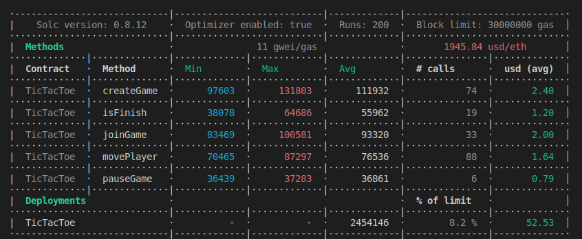

## ilink Academy. Домашняя работа #2. 

### Задача:  
Игра крестики-нолики.  
Игроки по очереди ставят на свободные клетки поля 3×3 знаки (один всегда крестики, другой всегда нолики).  
Первый, выстроивший в ряд 3 своих фигуры по вертикали, горизонтали или диагонали, выигрывает.  
Первый ход делает игрок, ставящий крестики.  

1. Создание игры одним из игроков.  
2. Второй участник может присоединиться к свободной игре.  
3. Игра считается завершенной если один из участников собрал в ряд 3 фигуры или завершилось время ожидания на ход соперника.  
4. Статистика по игрокам и играм.  

### Реализация
Hardhat 2.9.1;  
Solidity 0.8.12;

### Решение

#### Контракт:  
Смарт контракт состоит из: 
1. Структура Game, которая описывает партию игры
- address player1 - Адрес первого игрока;  
- address player2 - Адрес второго игрока (Либо nulll address);  
- uint8[9] grid - Игровое поле 3*3. Счет идет с верхнего левого угла, по строкам;  
- uint256 timeStart - Момент времени, когда был совершен крайних ход (в секундах, начиная с 1 января 1970 года (эпоха unix));  
- uint32 timeWait - Время ожидания хода соперника, в секундах;  
- State state - Текущий статус игры.

2. Перечисление State, которая описает все стадии игры:  
- FindPlayers - Стадия поиска (ожидание присоединения) второго игрока;  
- EndFirst - Первый игрок сделал свой ход;  
- EndSecond - Второй игрок сделал свой ход;  
- Pause - Первый игрок не дождался подключения второго игрока и поставил поиск на паузу;  
- Draw - Игра завершилась ничьей;  
- WinFirst - Игра завершилась победой первого игрока;  
- WinSecond - Игра завершилась победой второго игрока.  

3. Массив Game[] games, который хранит все игры.  
4. Массив  uint8[3][8] winCombinations, который хранит все возможные победные комбинации.  
5. Соответствие mapping (address => uint256) public playerGamesCount; // соответствие (адрес игрока => количество игр) 

Реализованные методы:
1. Создать игру:  
`function createGame(uint32 _timeWait) external`  
_timeWait - время ожидания хода соперника.  

2. Поставить на паузу/возобновить поиск второго игрока для присоединения к игре:  
`function pauseGame(uint256 _idGame) external outOfRange(_idGame)`  
_idGame - Идентификатор игры (её порядковый номер в массиве games).  

3. Присоединиться к игре:  
`function joinGame(uint256 _idGame) external outOfRange(_idGame)`  
_idGame - Идентификатор игры (её порядковый номер в массиве games).  

4. Сделать ход:  
`function movePlayer(uint256 _idGame, uint256 _cell) external outOfRange(_idGame)`  
_idGame - Идентификатор игры (её порядковый номер в массиве games), _cell - клетка на игровом поле (0..8).   

5. Завершить игру (Проверить на признаки завершения):  
`function isFinish(uint256 _idGame) external outOfRange(_idGame) returns (uint256)`  
_idGame - Идентификатор игры (её порядковый номер в массиве games).  

6. Найти игру с заданными параметрами:  
`function findOneGame(uint256 _indexBegin, uint256 _timeMin, uint256 _timeMax) external view returns (uint256) {`  
_indexBegin - Номер с которого осуществить поиск игры, _timeMin - минимальное время ожидания хода соперника, _timeMax - максимальное время ожидания хода соперника.  

7. Получить полную информацию об одной игре:  
`function getOneGame(uint256 _idGame) external view outOfRange(_idGame) returns (Game memory)`  
_idGame - Идентификатор игры (её порядковый номер в массиве games).  

8. Получить все игры конкретного игрока:  
`function getGamesByPlayer(address _player) external view returns (uint256[] memory)`  
_player - Адрес игрока.  

9. Получить статистику по игроку:  
`function statisticsPlayer(address _player) external view returns (uint256[] memory)`  
_player - Адрес игрока.  

10. Получить статистику по всем играм:  
`function statisticsGames() external view returns (uint256[] memory)`  

#### Задачи для cli hardhat
Смарт контракт размещался в тестовой сети Rospen.
1. Создать игру:  
`npx hardhat create-game --network ropsten --address $address --player $player --time $time`  
$address - адрес контракта, $player - порядковый номер счета из mnemonic, $time - время ожидания хода соперника. 

2. Поставить на паузу/возобновить поиск второго игрока для присоединения к игре:  
`npx hardhat pause-game --network ropsten --address $address --player $player --id $id`  
$address - адрес контракта, $player - порядковый номер счета из mnemonic, $id - идентификатор игры (её порядковый номер в массиве games).  

3. Присоединиться к игре:  
`npx hardhat join-game --network ropsten --address $address --player $player --id $id`  
$address - адрес контракта, $player - порядковый номер счета из mnemonic, $id - идентификатор игры (её порядковый номер в массиве games).  

4. Сделать ход:  
`npx hardhat move-game --network ropsten --address $address --player $player --id $id --cell $cell`  
$address - адрес контракта, $player - порядковый номер счета из mnemonic, $id - идентификатор игры (её порядковый номер в массиве games), $cell - клетка на игровом поле (0..8).  

5. Завершить игру (Проверить на признаки завершения):  
`npx hardhat isFinish --network ropsten --address $address --player $player --id $id`  
$address - адрес контракта, $player - порядковый номер счета из mnemonic, $id - идентификатор игры (её порядковый номер в массиве games).  

6. Найти игру с заданными параметрами:  
`npx hardhat find-game --network ropsten --address $address --player $player --index $index --timeMin $timeMin --timeMax $timeMax`  
$address - адрес контракта, $player - порядковый номер счета из mnemonic, $index - номер с которого осуществить поиск игры, $timeMin - минимальное время ожидания хода соперника, $timeMax - максимальное время ожидания хода соперника.  

7. Получить полную информацию об одной игре:  
`npx hardhat get-one-game --network ropsten --address $address --id $id`  
$address - адрес контракта, $id - идентификатор игры (её порядковый номер в массиве games).  

8. Получить все игры конкретного игрока:  
`npx hardhat get-player-games --network ropsten --address $address --player $player`  
$address - адрес контракта, $player - адрес игрока.  

9. Получить статистику по игроку:  
`npx hardhat get-statistic-player --network ropsten --address $address --player $player`  
$address - адрес контракта, $player - адрес игрока.  

10. Получить статистику по всем играм:
`npx hardhat get-statistic-games --network ropsten --address $address`  
$address - адрес контракта.  

#### Тестирование
Автоматизированные тесты описаны в файле tests\TicTacToe.test.ts и запускаются командой:  
`npx hardhat test tests\TicTacToe.test.ts`

Анализ расхода газа можно включить с помощью ключа GAS_REPORT:

#### Проверка и публикация исходного кода контракта
Команда для публикации контракта в тестовой сети ropsten:  
`npx hardhat deploy --network ropsten --tags TicTacToe`

Команда для верификации контракта в сети ropsten:  
`npx hardhat --network ropsten etherscan-verify --solc-input --contract-name TicTacToe
`

Адрес смарт контракта: `0xb57Dd0B9d024f8F3D2BD9fe1f82222A1026829c8`

